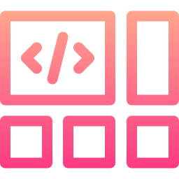

<p align="center">
  
</p>

<h1 align="center">
  Layouts
</h1>

<p align="center">
  Layouts with HTML and CSS only
</p>

## Table Of Contents

- [Utils](#utils)
- [Technology Stack](#technology-stack)
- [How To Start](#how-to-start)
- [License](#license)

## Utils

- ESLint
- Stylelint
- Commitlint
- Prettier
- Husky

## Technology Stack

- TypeScript
- Storybook
- HTML and CSS

## How To Start

Recommended editor: `Visual Studio Code`

Required tools:

- Git
- Node.js
- Yarn

Download project:

```bash
git clone https://github.com/Trequend/layouts.git
cd layouts
```

Install dependencies:

```bash
yarn install
```

Start storybook:

```bash
yarn run storybook
```

## License

MIT

Logo icon made by <a href="https://www.flaticon.com/authors/freepik" title="Freepik">Freepik</a> from <a href="https://www.flaticon.com/" title="Flaticon">www.flaticon.com</a>
